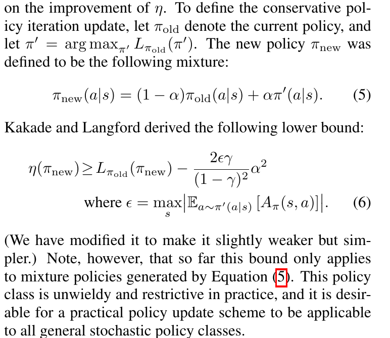

# Study Notes from ZW

1. Features:

   1. Iterative procedure for optimizing **policies**
   2. guaranteed monotonic improvement
   3. similar to natural policy gradient methods and is effective for optimizing large nonlinear policies

2. policy optimization categories:

   1. policy iteration methods: estimating value function
   2. policy gradient methods: estimating gradient of the expected return (total reward) obtained from sample trajectories
   3. derivative-free optimization methods: cross-entropy method (CEM) and covariant matrix adaptation (CMA), which treat the return as a black box function to be optimized
      1. preferred on many problems because they are simple to understand and implement

3. Motivation:

   1. Let Approximate Dynamic Programming (ADP) methods and gradient-based methods to beat gradient-free random search
   2. gradient-based optimization algorithms enjoy much better sample complexity (?) guarantees than gradient-free methods
   3. continuous gradient-based optimization has been very successful at supervised learning (Deep Learning)

4. Theory:

   1. Minimizing a certain surrogate objective function guarantees policy improvement with non-trivial step sizes
   2. approximate to the theoretically-justified algorithm
      1. single-path method, which can be applied in the model-free setting
      2. vine method, which requires the system to be restored to particular states, which is typically only possible in simulation

5. Preliminaries

   1. Infinite-horizon discounted MDP  $(\mathcal{S}, \mathcal{A}, P, r, \rho_0, \gamma)$

      1. $\mathcal{S}$: finite set of states
      2. $\mathcal{A}$: finite set of actions
      3. $P: \mathcal{S} \times \mathcal{A} \times \mathcal{S} \rightarrow \mathbb{R}$ : transition probability distribution
      4. $r : \mathcal{S} \rightarrow \mathbb{R}$  reward function
      5. $\rho_0: \mathcal{S} \rightarrow \mathbb{R}$  distribution of the initial stats $s_0$
      6. $\gamma \in (0,1)$ discount factor

   2. Stochastic policy: $\pi: \mathcal{S} \times \mathcal{A} \rightarrow [0,1]$, and let $\eta(\pi)$ denote its expected discount reward

      1. $\eta(\pi ) = \mathbb{E}_{s_0, a_0,\dots} [\sum_{t=0}^{\infty} \gamma^t r(s_t)]$  where $s_0 \sim \rho_0(s_0), a_t \sim \pi(a_t|s_t), s_{t+1}\sim P(s_{t+1}|s_t,a_t)$

   3. State action value function $Q_\pi$, value function $V_{\pi}$ and advantage function $A_{\pi}$

      1. $Q_{\pi}(s_t, a_t) = \mathbb{E}_{s_{t+1}, a_{t+1}, \dots} [\sum_{l=0}^{\infty} \gamma^l r(s_{t+l})]$
      2. $V_{\pi}(s_t) = \mathbb{E}_{a_t,s_{t+1},\dots} [\sum_{l=0}^{\infty} \gamma^l r(s_{t+l})]$
      3. $A_\pi(s,a)=Q_{\pi}(s,a) - V_\pi(s)$

   4. expected return of another policy $\tilde{\pi}$ in terms of advantage over $\pi$, accumulated over timesteps

      1. $\eta(\tilde{\pi} ) = \eta(\pi) + \mathbb{E}_{s_0, a_0,\dots \sim \tilde\pi} [\sum_{t=0}^{\infty} \gamma^t A_\pi(s_t, a_t)]  \ \ \ \  (1)$
      2. $\mathbb{E}_{s_0, a_0,\dots \sim \tilde\pi}$ indicates that actions are sampled $a_t \sim \tilde\pi(\cdot|s_t)$

   5. Rewrite equation $(1)$ into sum over states instead of timesteps

      1. $$\eta(\tilde{\pi} ) = \eta(\pi) + \sum_{t=0}^{\infty}\sum_sP(s_t = s |\tilde \pi) \sum_a \tilde\pi(a|s)\gamma^t A_\pi(s, a)$$

         $$\eta(\tilde{\pi} ) = \eta(\pi) + \sum_s\sum_{t=0}^{\infty}\gamma^tP(s_t = s |\tilde \pi) \sum_a \tilde\pi(a|s) A_\pi(s, a)$$

         $$\eta(\tilde{\pi} ) = \eta(\pi) + \sum_s\rho_{\tilde\pi(s)} \sum_a \tilde\pi(a|s) A_\pi(s, a) \ \ \ \ \ (2)$$

      2. where the unnormalized discounted visitation frequencies is $\rho_\pi(s) = P(s_0 = s) + \gamma P(s_1 = s) + \gamma^2 P(s_2 = 2) + \dots$

      3. This equation implies that any policy update $\pi \rightarrow \tilde\pi$ that has a nonnegative expected advantage at _every_ state s, $\sum_a\tilde\pi(a|s) A_\pi(s, a) \ge 0$, is guaranteed to increase the policy performance $\eta$ . But in the approximate setting, it will typically be unavoidable, due to estimation and approximation error, that there will be some states $s$ whose expected advantage is negative.

   6. Local approximation to $\eta$

      1. $L_\pi(\tilde\pi) =  \eta(\pi) + \sum_s\rho_{\pi(s)} \sum_a \tilde\pi(a|s) A_\pi(s, a) \ \ \ \ (3) $ 
         1. it uses visitation frequence $\rho_\pi$ instead of $\rho_{\tilde\pi}$, **ignoring changes in state visitation density due to changes in the policy**
         2. However, if we have a parameterized policy $\pi_{\theta}$, .., then $L_\pi$ matches $\eta$ to first order. That is, for any parameter value $\theta_0$
            1. $L_{\pi_{\theta_0}} = \eta(\pi_{\theta_0})$
            2. $\nabla_\theta L_{\pi_{\theta_0}}(\pi_\theta)|_{\theta=\theta_0} = \nabla_\theta \eta(\pi_\theta)|_{\theta=\theta_0} \ \ \ \ \ (4)$
      2. Equation (4) implies that a sufficiently smalls step $\pi_{\theta_0} \rightarrow \tilde\pi$ that improves $L_{\pi_{\theta_{\text{old}}}}$ will also improve $\eta$, but **does not give us any guidance on how big of a step to take**.

   7. Policy updating scheme: conservative policy iteration. It provide explicit lower bounds on the improvement of $\eta$ by **using new policy as a mixture of current policy and argmax policy.**

      1. 

6. Monotonic Improvement Guarantee for General Stochastic policies

   1. extend  mixture policies to general stochastic policies by **replacing $\alpha$ with a distance measure between $\pi$ and $\tilde\pi$ and changing the constant $\epsilon$ appropriately**

      1. distance measure: total variation divergence $D_{TV}(p||q) = \frac{1}{2}\sum_i|p_i-q_i|$ for discrete probability distributions.  $D_{TV}^{\max}(\pi||\tilde\pi) = \max_s D_{TV}(\pi(\cdot|s) || \tilde\pi(\cdot|s))$

   2. 

   3. using the relationship between total variation divergence and KL divergence: $D_{TV}(p||q)^2 \le D_{KL}(p||q)$ then the equation (8) becomes 

      $\eta(\tilde\pi) \ge L_\pi(\tilde\pi) - C D_{KL}^\max(\pi, \tilde\pi)$, where $C = \frac{4\epsilon \gamma}{(1-\gamma)^2}$     (9)

   4. 

      

   

   

   